# GitSimplilearn
Git and github tutorials for beginners
This is a test line

GIT HUB AND GIT TRAINING
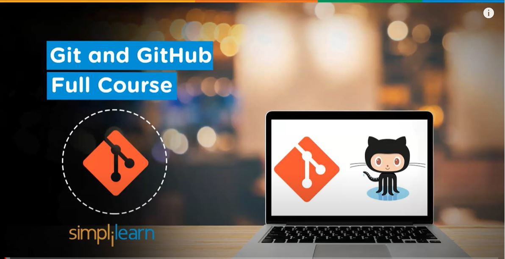

WHAT ARE YOU GOING TO LEARN?
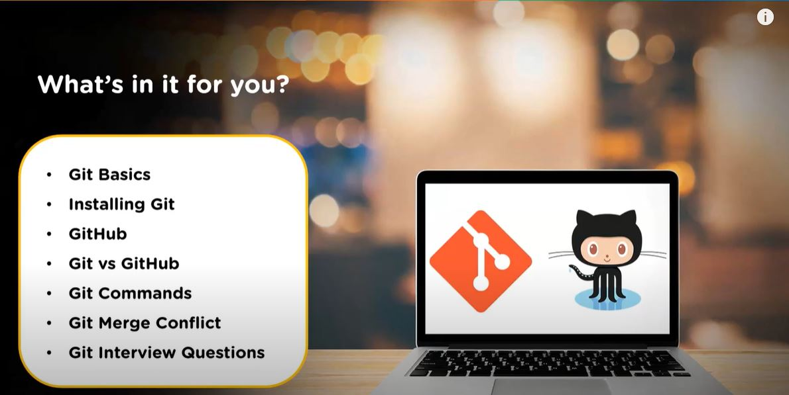

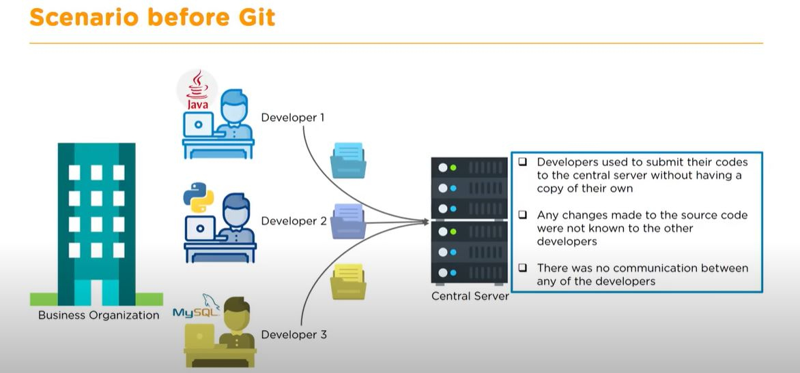

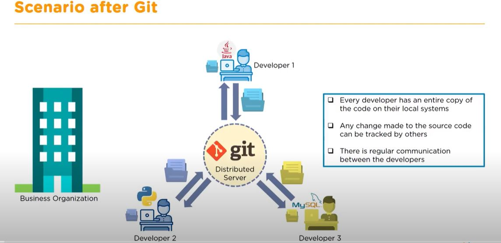

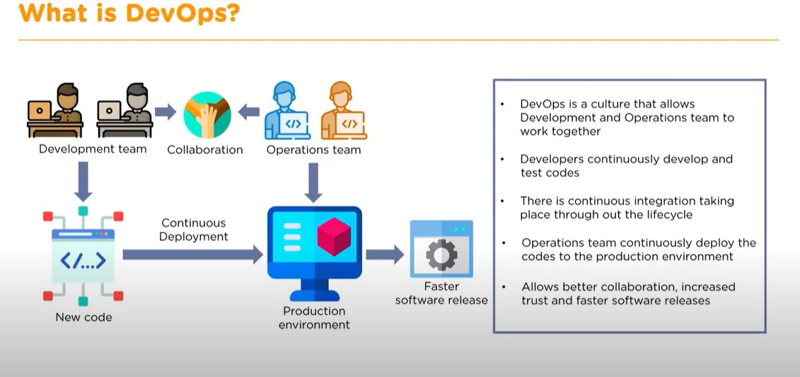

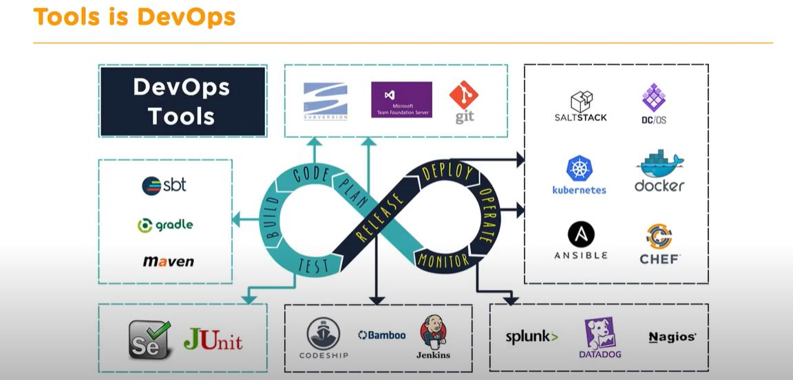

1. SUBVERSION - SVN
2. TEAM FOUNDATION SERVICE -TFS
3. GIT

**SUBVERSION - SVN**
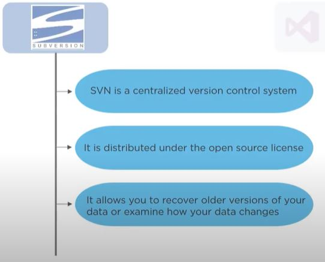

**TEAM FOUNDATION SERVICE - TFS**
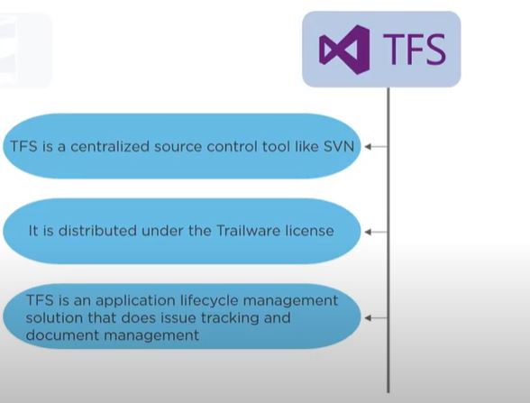

**GIT**
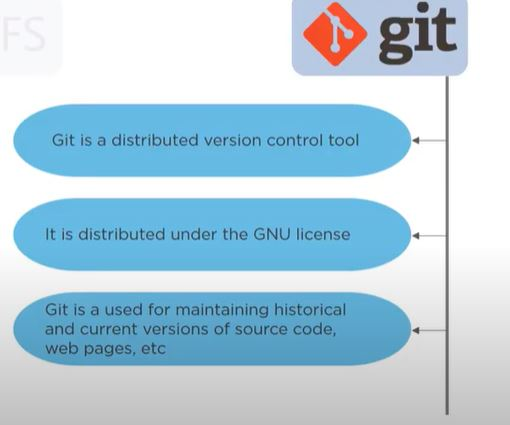

**WHAT IS GIT?**

Git is version control system for tracking changes in computer files. It is generally used for source code management in software development.

1. Git is used to track changes in the source code
2. Allow multiple developers work together
3. Supports non-linear development beacuse of its thousands of parallel branches

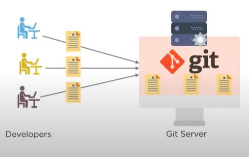

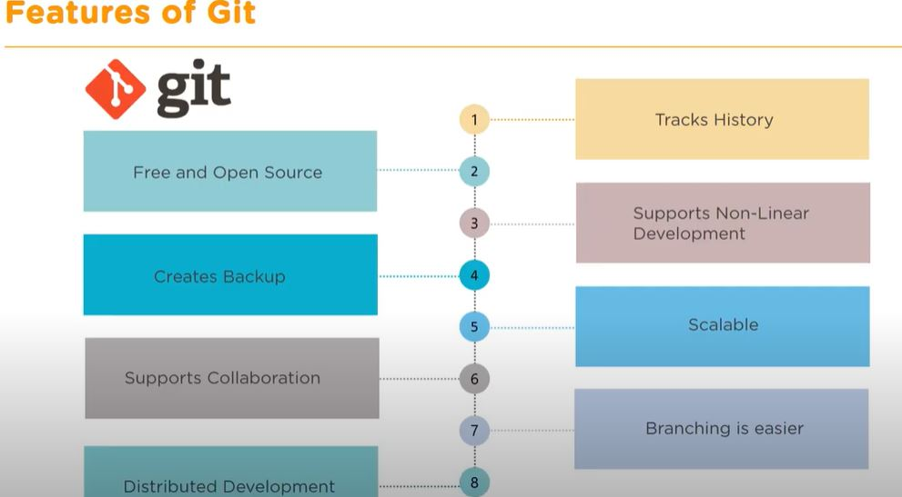

GIT HAS THREE STAGES TO PERFORM

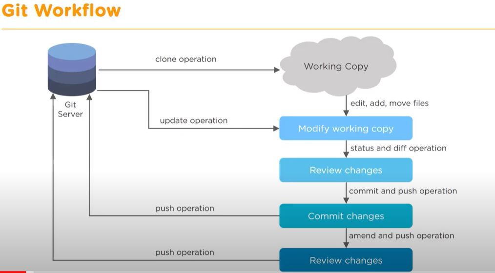

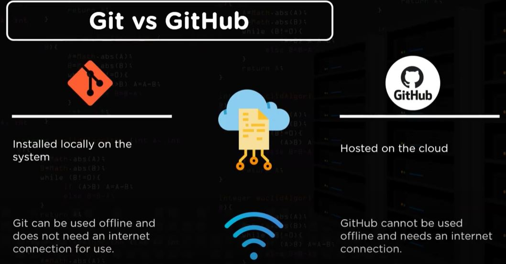
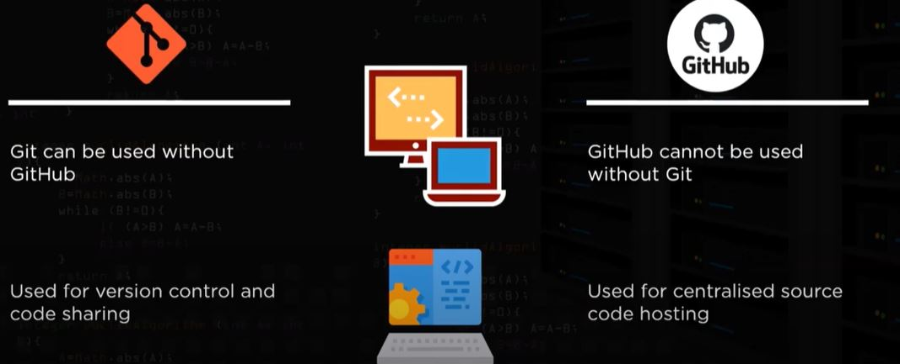
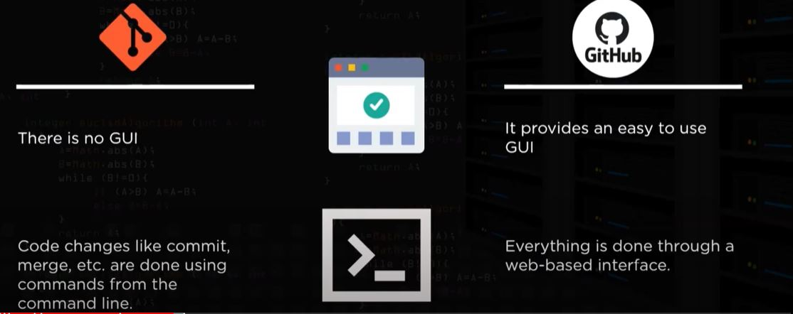
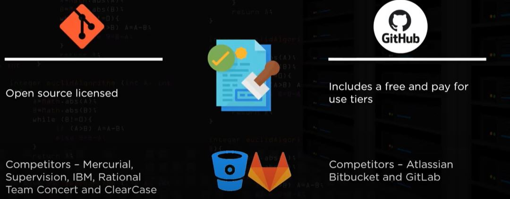

**GIT COMMANDS**

# 1. git init command
a. The Git init command creates a new Git repository. The init command sets up all the configuration files you need to work with git in a folder called .git/. You only need to run the git init command once.

b. The git init command creates an empty Git repository. init can be used to convert an existing project into a Git repository. The init command can also initialize an empty repository for a new project.