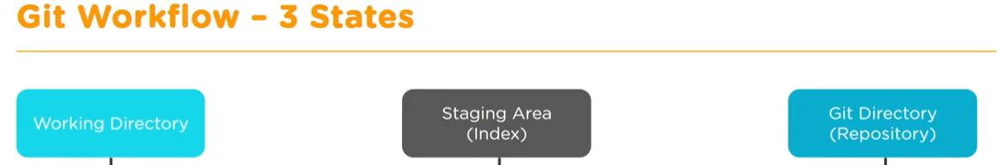

# GitSimplilearn
Git and github tutorials for beginners
This is a test line

GIT HUB AND GIT TRAINING

WHAT ARE YOU GOING TO LEARN?

1. SUBVERSION - SVN
2. TEAM FOUNDATION SERVICE -TFS
3. GIT

**SUBVERSION - SVN**

**TEAM FOUNDATION SERVICE - TFS**

**GIT**

**WHAT IS GIT?**

Git is version control system for tracking changes in computer files. It is generally used for source code management in software development.

1. Git is used to track changes in the source code
2. Allow multiple developers work together
3. Supports non-linear development beacuse of its thousands of parallel branches

GIT HAS THREE STAGES TO PERFORM

**GIT COMMANDS**

**1. git config command**

command returns a list of information about your git configuration including user name and email.

**2. git config --global user.name "Jay"**

The command configure your user name

**3. git config --global user.email "signups@fabiopacifici.com"**

setup the user email address you'll use in your commits

**4. git init**

Everything starts from here. The first step is to initialize a new Git repo locally in your project root.

**5. git add filename_here**

The command will add a file to the staging area. Just replace filename_here with the name of the file you want to add to the staging area.

**6. git add .**

To add all files in your project to the staging area, you can use a wildcard . and every file will be added for you.

**7. git status**

This command will show the status of the current repository including staged, unstaged, and untracked files.

**8. git commit**

This command will open a text editor in the terminal where you can write a full commit message.

A commit message is made up of a short summary of changes, an empty line, and a full description of the changes after it.

**9. git commit -m "your commit message here"**

You can add a commit message without opening the editor. This command lets you only specify a short summary for your commit message.

**10. git commit -a -m"your commit message here"**

You can add and commit tracked files with a single command by using the -a and -m options.

**11. git log**

This command shows the commit history for the current repository

**12. git log -p**

This command shows the commit's history including all files and their changes

**13. git diff**

git diff shows only unstaged changes by default

**14. git add -p**

This command opens a prompt and asks if you want to stage changes or not, and includes other options.

**15. git rm filename**

To remove tracked files from the current working directory. This command expects a commit message to explain why the file was deleted.

**16. git mv oldfile newfile**

To rename files in git. This command stages the changes, then it expects a commit message.

**17. .gitignore**

To ignore files in git. Not to track those files

**18. git revert**

The git revert command is used for undoing changes to a repository's commit history. Other 'undo' commands like, git checkout and git reset, move the HEAD and branch ref pointers to a specified commit. Git revert also takes a specified commit, however, git revert does not move ref pointers to this commit. A revert operation will take the specified commit, inverse the changes from that commit, and create a new "revert commit". The ref pointers are then updated to point at the new revert commit making it the tip of the branch.

**19. git branch**

The git branch command lets you create, list, rename, and delete branches. It doesn’t let you switch between branches or put a forked history back together again. For this reason, git branch is tightly integrated with the git checkout and git merge commands.

**20. git branch -d <branch>**

Delete the specified branch. This is a “safe” operation in that Git prevents you from deleting the branch if it has unmerged changes.

**21. git branch -D <branch>**

Force delete the specified branch, even if it has unmerged changes. This is the command to use if you want to permanently throw away all of the commits associated with a particular line of development.